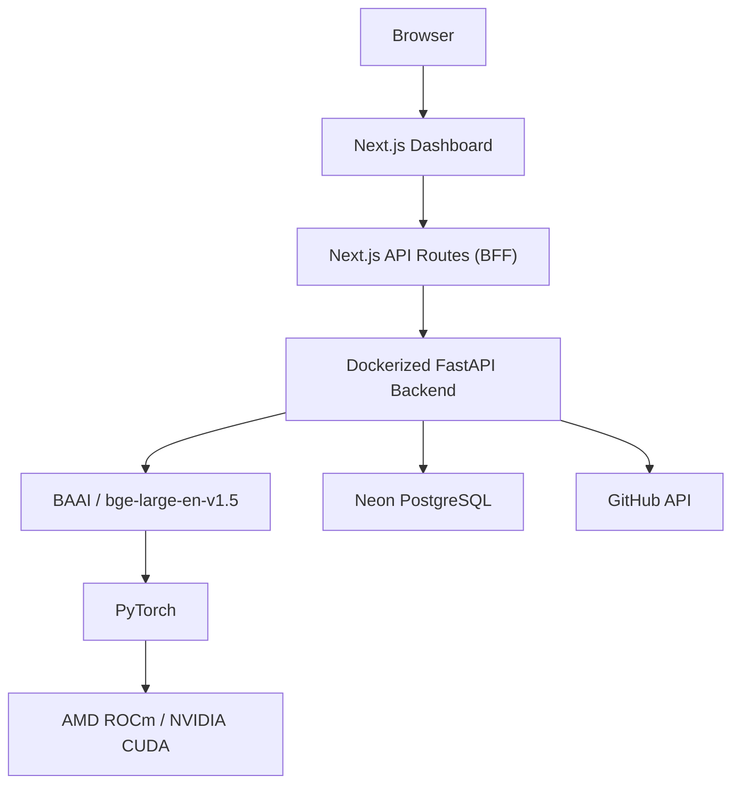

# CandidAI | Candidate Intelligence Dashboard

CandidAI is an AI-powered candidate intelligence platform that helps solo founders and early-stage startups identify the strongest technical candidates using semantic search instead of traditional keyword matching.

The platform combines **semantic embeddings**, **GPU-accelerated inference**, **GitHub enrichment**, and **AI-generated interview questions** to automate technical candidate evaluation while maintaining a production-oriented architecture.

---

# Overview

Unlike traditional Applicant Tracking Systems, CandidAI treats candidate ranking as a **semantic retrieval problem** rather than a text generation problem.

Instead of using a Large Language Model for ranking, CandidAI uses the **BAAI/bge-large-en-v1.5** embedding model to compare job descriptions and candidate profiles in vector space.

Generative AI is only used where it adds value:
- Interview Question Generation

---

# Architecture



---

# Why Embeddings Instead of an LLM?

Candidate ranking is fundamentally a **retrieval problem—not a generative AI problem.**

Instead of sending resumes through a Large Language Model, CandidAI generates semantic embeddings and performs vector similarity search.

Benefits:

- Deterministic rankings
- Lower inference latency
- Lower GPU memory usage
- Lower deployment cost
- No hallucinations
- Better suited for semantic similarity

Large Language Models are reserved for generating personalized interview questions.

---

# Features

- Semantic candidate ranking using BAAI/bge-large-en-v1.5
- GPU accelerated embedding generation
- Candidate clustering using GPU K-Means
- GitHub profile enrichment
- AI-generated interview questions
- Dockerized inference backend
- AMD ROCm deployment support
- NVIDIA CUDA support
- Secure Next.js Backend-for-Frontend architecture
- Toggleable Demo Mode
- GPU Diagnostics panel

---

# Tech Stack

## Frontend

- Next.js (App Router)
- React
- TypeScript
- Tailwind CSS
- Lucide Icons

## Backend

- FastAPI
- PyTorch
- SentenceTransformers
- SQLAlchemy
- Pydantic
- uv

## AI

- BAAI/bge-large-en-v1.5
- Semantic Embeddings
- GPU K-Means Clustering

## Database

- Neon PostgreSQL

## Infrastructure

- Docker
- AMD ROCm
- NVIDIA CUDA

---

# Repository Structure

```text
candid/
│
├── backend/
│   ├── app/
│   │   ├── api/
│   │   ├── services/
│   │   ├── models/
│   │   ├── schemas/
│   │   ├── config/
│   │   └── main.py
│   │
│   ├── Dockerfile.local
│   ├── Dockerfile.production
│   ├── pyproject.toml
│   ├── uv.lock
│   └── .env.example
│
├── frontend/
│   ├── src/
│   ├── public/
│   ├── package.json
│   └── .env.example
│
└── README.md
```

---

# Environment Variables

## Frontend

```env
AMD_BACKEND_URL=http://localhost:8000
```

---

## Backend

```env
DATABASE_URL=

DEMO_MODE=true

HF_HOME=/root/.cache/huggingface

TORCH_HOME=/root/.cache/torch
```

---

# Local Development

## Backend

```bash
cd backend

uv sync

# Windows
.venv\Scripts\activate

# Linux/macOS
source .venv/bin/activate

uvicorn app.main:app --host 0.0.0.0 --port 8000
```

---

## Frontend

```bash
cd frontend

npm install

npm run dev
```

Application:

```
http://localhost:3000
```

---

# Local Docker (CUDA)

Build

```bash
docker build \
-f backend/Dockerfile.production \
-t candid-backend \
backend
```

Run

```bash
docker run --rm \
--gpus all \
-p 8000:8000 \
--env-file backend/.env.local \
--name candid-backend \
candid-backend
```

---

# AMD ROCm Deployment

Build

```bash
docker build \
-f backend/Dockerfile.production \
-t candid-backend \
backend
```

Run

```bash
docker run \
--device=/dev/kfd \
--device=/dev/dri \
--group-add video \
-p 8000:8000 \
--env-file backend/.env \
candid-backend
```

---

# API

Swagger UI

```
http://localhost:8000/docs
```

OpenAPI

```
http://localhost:8000/openapi.json
```

---

# Production Design

The browser never communicates directly with the inference backend.

All requests follow the flow:

```
Browser

↓

Next.js Dashboard

↓

Next.js API Routes (BFF)

↓

FastAPI Inference Service

↓

GPU
```

This keeps the inference endpoint private while allowing independent scaling of the frontend and backend.

---

# AMD GPU Deployment

The inference backend has been successfully deployed on:

- AMD Instinct MI300X
- ROCm
- PyTorch ROCm
- Docker

The same application also runs locally on NVIDIA CUDA with minimal configuration changes.

---

# License

Created for the **AMD Developer Challenge Act II**.