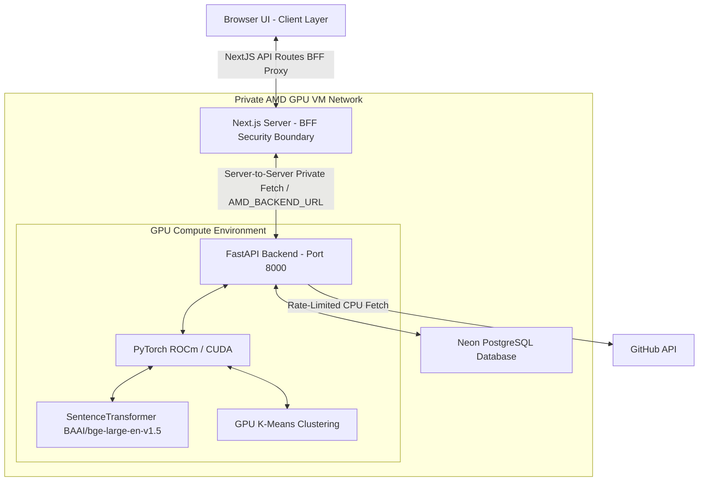

# CandidAI | Candidate Intelligence Dashboard

CandidAI is an enterprise SaaS recruitment screening and candidate intelligence platform optimized for **AMD Developer Cloud GPUs**. The system utilizes high-dimensional semantic search and vector space clustering to rank and cohort applicants against targeted job descriptions in real time.

---

## Architecture Diagram



---

## Key Features

1. **High-Dimensional Match Matrix**: Evaluates multi-dimensional semantic alignment scores using `BAAI/bge-large-en-v1.5` embeddings on AMD GPUs.
2. **GPU Cohort Clustering**: Groups applicant profiles into technical talent groups using a PyTorch-based K-Means clustering algorithm compiled directly on the GPU.
3. **CPU Document Ingestion**: Parses PDFs on the CPU, isolating email, phone, experiences, and technical vocabulary tags.
4. **Failsafe GitHub Profiling**: Extracts open-source repository descriptions, languages, and star metrics. If rate-limits are hit, logs are written internally and a clean mock profile is returned to keep the demo flow fully operational.
5. **Secure Next.js BFF Architecture**: The browser never directly interacts with port 8000 or the FastAPI VM URL. All communication is routed through server-to-server App Router API routes using `AMD_BACKEND_URL`.
6. **Performance Warm Start**: On server boot, PyTorch asynchronously pre-loads model weights and processes a warmup batch on the GPU, avoiding cold start lag during judging.
7. **Toggleable Demo Mode**: A secured toggle switch in the dashboard allows administrators to reveal diagnostic panels (timings, vector batch sizes, device type) and seed the DB with realistic candidates.

---

## Repository Structure

```text
├── backend/
│   ├── main.py              # FastAPI app and startup warmups
│   ├── config.py            # Settings loaded from environment variables
│   ├── db.py                # SQLAlchemy DB engine and Session Pools
│   ├── models.py            # Job and Candidate schemas mapped to PostgreSQL
│   ├── schemas.py           # Pydantic validation schemas
│   ├── test_backend.py      # Python backend unit tests
│   ├── Dockerfile.local     # Local CUDA developer container
│   ├── Dockerfile.production# AMD ROCm Cloud production container
│   ├── pyproject.toml       # UV package manager definition
│   └── services/            # Embedding, parser, github, and intelligence modules
├── frontend/
│   ├── src/app/             # Next.js App Router (Landing, Login, Dashboard, BFF)
│   ├── src/components/      # Reusable React components (Header, Sidebar, GPU Diagnostics)
│   ├── src/styles/          # Dedicated CSS styling
│   └── package.json         # NPM package dependencies
└── README.md                # Root project documentation
```

---

## Environment Variables

Configure these settings via your `.env` or VM environments:

### Next.js BFF Server (`/frontend`)
* `AMD_BACKEND_URL`: Private endpoint of the FastAPI VM (e.g. `http://fastapi-vm:8000` or `http://localhost:8000`). **Never exposed to the client.**

### FastAPI Backend (`/backend`)
* `DATABASE_URL`: Connection string for **Neon PostgreSQL** database.
* `DEMO_MODE`: Set to `true` (default) to enable the protected `/api/demo/seed` routing.
* `HF_HOME`: Storage directory for HuggingFace caching (`/root/.cache/huggingface`).

---

## Local Setup

### Prereqs
* Python >= 3.10 and Node.js >= 18.
* [uv](https://github.com/astral-sh/uv) (recommended Python manager).

### 1. Run the Python FastAPI Backend
```bash
cd backend
# Synchronize environment dependencies
uv sync
# Activate virtual environment
source .venv/bin/activate  # On Windows: .venv\Scripts\activate
# Start Uvicorn
uvicorn backend.main:app --host 0.0.0.0 --port 8000
```

### 2. Run the Next.js Frontend BFF
```bash
cd ../frontend
# Install NPM dependencies
npm install
# Start local dev server
npm run dev
```
Open `http://localhost:3000` to view the SaaS Landing Page.

---

## Docker Usage

Build and deploy using localized GPU configurations:

### Nvidia Local CUDA Run (RTX 4060)
```bash
cd backend
docker build -f Dockerfile.local -t candid-backend-cuda .
docker run --gpus all -p 8000:8000 -v hf_cache:/root/.cache/huggingface -e DATABASE_URL="your-neon-url" candid-backend-cuda
```

### AMD Instinct GPU Cloud Run (ROCm)
```bash
cd backend
docker build -f Dockerfile.production -t candid-backend-rocm .
docker run --device=/dev/kfd --device=/dev/dri -p 8000:8000 -v hf_cache:/root/.cache/huggingface -e DATABASE_URL="your-neon-url" candid-backend-rocm
```

---

## Technology Stack

* **Frontend**: Next.js (App Router, BFF architecture), React, TypeScript, Tailwind CSS, Lucide icons.
* **Backend**: FastAPI (Python), PyTorch (ROCm & CUDA capability), SentenceTransformers (`BAAI/bge-large-en-v1.5`), SQLAlchemy ORM, Pydantic validation.
* **Database**: Neon Serverless PostgreSQL.
* **Orchestration**: uv (Python packages), Docker containers.
